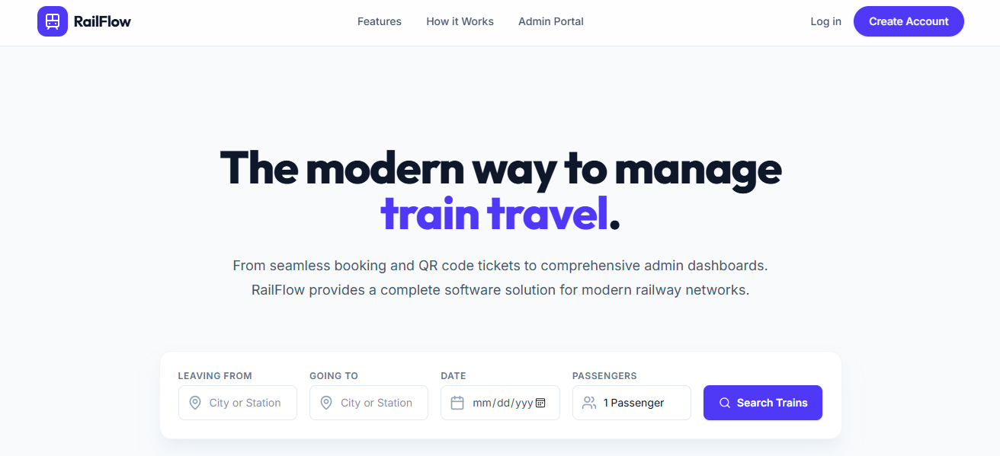
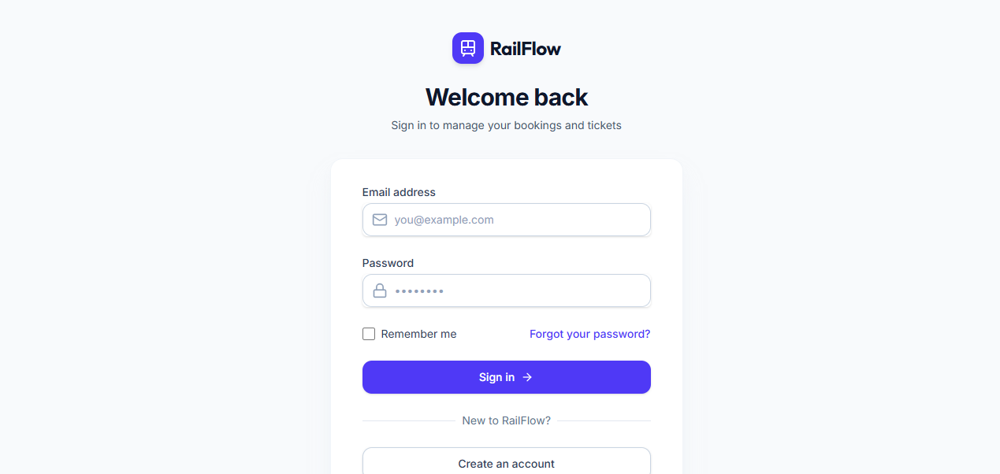

Ella ticketing platform
=======================
A safe and a modern solution for train ticketing in Ella station.

URL (demo run): https://youtu.be/3BnAV65zlcw?si=5RztpLkUPqwYdvh9

About the project
-----------------

This platform aims to digitize and streamline the train ticketing process specifically tailored for the railway department. The goal is to provide a reliable, modern interface for travelers while improving operational efficiency and ticketing security for station management.

Screenshots
-----------------

Technologies used
-----------------

*   **Frontend:** ReactJS
    
*   **Backend:** Spring Boot
    
*   **Database:** Oracle SQL
    
*   **Monitoring & Logging:** Grafana, Loki, Promtail
    

Repository structure
--------------------

*   /Code - Contains the complete source code for the frontend and backend applications.
    
*   /Diagrams - Includes system architecture, database schemas, and sequence diagrams detailing the ticketing flow.
    

Getting started
---------------

Follow these instructions to set up the project locally on a Windows environment.

### Prerequisites

Ensure you have the following installed on your Windows operating system:

*   Git
    
*   Java Development Kit (JDK) 17 or higher
    
*   Node.js and npm
    

### Installation and Setup

#### 1\. Clone the repository

git clone [https://github.com/RavinJayasanka/Ella-Ticketing-Platform.git](https://github.com/RavinJayasanka/Ella-Ticketing-Platform.git)

cd Ella-Ticketing-Platform

#### 2\. Database Setup (Oracle SQL)

1.  **Install Oracle Database Express Edition (XE):**
    
    *   Download the Oracle Database XE for Windows from the official Oracle website.
        
    *   Run the installer and follow the on-screen instructions. **Remember the system password** you set during installation.
        
2.  **Install Oracle SQL Developer:**
    
    *   Download Oracle SQL Developer for Windows.
        
    *   Extract the zip file and run sqldeveloper.exe.
        
3.  ALTER SESSION SET "\_ORACLE\_SCRIPT"=true;CREATE USER EllProject IDENTIFIED BY your\_secure\_password;GRANT ALL PRIVILEGES TO EllProject;
    
    *   Open SQL Developer and create a new connection using the default credentials (Username: sys, Role: SYSDBA, Password: the one you set during installation).
        
    *   Open a new SQL worksheet and execute the following commands to create the EllProject user/database and grant necessary permissions:
        
4.  **Update Application Credentials:**
    
    *   Navigate to your Spring Boot application's configuration file (e.g., src/main/resources/application.properties).
        
    *   Update the database URL, username, and password to match the EllProject credentials you just created.
        

#### 3\. Monitoring Setup (Grafana, Loki, Promtail)

Set up the logging and monitoring stack directly on Windows.

1.  **Install Grafana:**
    
    *   Download the Grafana Windows installer (.msi) from the official Grafana website.
        
    *   Run the installer. Once finished, Grafana will run as a Windows service.
        
    *   Access the dashboard at http://localhost:3000 (Default login: admin / admin).
        
2.  .\\loki-windows-amd64.exe -config.file=loki-local-config.yaml
    
    *   Download the Loki Windows binary (loki-windows-amd64.exe.zip) from the Grafana Loki GitHub Releases page.
        
    *   Extract the .exe file into a dedicated folder (e.g., C:\\Loki).
        
    *   Download the default loki-local-config.yaml file from the Loki repository and place it in the same folder.
        
    *   Open Command Prompt, navigate to the folder, and run Loki:
        
3.  .\\promtail-windows-amd64.exe -config.file=promtail-local-config.yaml
    
    *   Download the Promtail Windows binary (promtail-windows-amd64.exe.zip) from the Grafana Loki GitHub Releases page.
        
    *   Extract it to a dedicated folder (e.g., C:\\Promtail).
        
    *   Download the default promtail-local-config.yaml file. Update the \_\_path\_\_ in the configuration to point to your Spring Boot application's log files.
        
    *   Open a new Command Prompt, navigate to the folder, and run Promtail:
        
4.  **Connect Loki to Grafana:**
    
    *   Open Grafana (http://localhost:3000).
        
    *   Go to **Connections** > **Data Sources** > **Add data source**.
        
    *   Select **Loki** and set the URL to http://localhost:3100.
        
    *   Click **Save & Test**.
        

#### 4\. Run the Application

*   **Backend:** Navigate to the Spring Boot directory in /Code and run the application using your IDE or via Maven/Gradle wrapper (e.g., mvnw spring-boot:run).
    
*   **Frontend:** Navigate to the React directory in /Code, install dependencies with npm install, and start the server with npm start.
